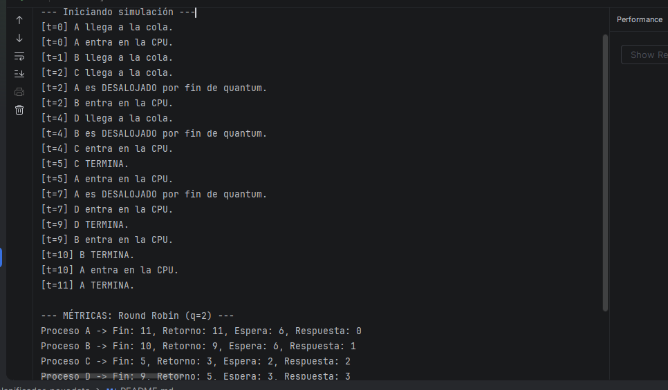
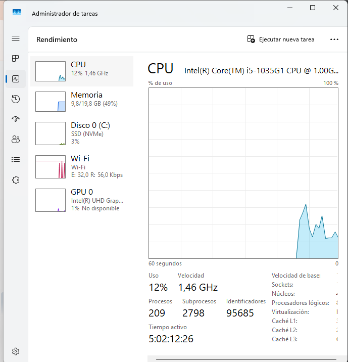

# Simulador de planificación · NexoData

> PSP · Tema 2 · Procesos · 2.º A DAM · **Jose Luis Martin Blanco**
> Sustituye todo lo que aparece entre corchetes y borra estas indicaciones cuando lo completes.

## 1. Qué hace

Un simulador básico que imita cómo un sistema operativo reparte la CPU entre varios procesos. Le pasas un archivo CSV con los datos de los procesos (cuándo llegan y cuánto duran) y aplica los algoritmos típicos de planificación para calcular los tiempos y sacar las métricas de rendimiento.
## 2. Cómo compilar y ejecutar

**Desde la terminal**, en la carpeta del proyecto:

```bash
javac -encoding UTF-8 -d out src/planificador/*.java
java -cp out planificador.Main datos/ejemplo_clase.csv rr 2 --traza
```

**Desde IntelliJ IDEA:** 1. Asegúrate de tener el JDK bien seleccionado en el proyecto.
2. Dale arriba a la derecha a "Edit Configurations...".
3. En la casilla de la clase principal (Main class), pon `planificador.Main`.
4. En los argumentos (Program arguments), escribe la ruta del archivo, el algoritmo y el quantum si hace falta (por ejemplo: `datos/ejemplo_clase.csv todos 2`).
5. En el directorio de trabajo (Working directory), selecciona la carpeta raíz del proyecto (`planificador-nexodata`).

![Mi programa en ejecución](capturas/[nombre-de-tu-captura].png)

## 3. Diseño

El proyecto está montado en Java orientado a objetos para que sea fácil de mantener:
- `Proceso`: Guarda la información básica de cada proceso (nombre, llegada, ráfaga, etc.) y sirve para clonar listas limpias.
- `LectorDatos`: Lee el archivo CSV línea por línea y crea los objetos de tipo proceso.
- `Planificador` (Clase abstracta): Lleva el control del bucle del tiempo de la simulación paso a paso y la lógica común.
- `FCFS`, `SJF` y `RoundRobin`: Heredan de la clase anterior y cada una aplica su propia política de colas y turnos.
- `Main`: Es el archivo principal que comprueba que todo esté bien escrito por consola y ejecuta las simulaciones y el cálculo de métricas.

## 4. Verificación (tarea 4)

### 4.1 verificacion.csv resuelto a mano
**Datos de entrada:**
- Proceso A: Llegada = 0, Ráfaga = 3
- Proceso B: Llegada = 1, Ráfaga = 2
- Proceso C: Llegada = 3, Ráfaga = 2

---

### A. Algoritmo FCFS (First-Come, First-Served)
Se atienden estrictamente por orden de llegada (A -> B -> C).

* **Diagrama de Gantt:**
  | A | A | A | B | B | C | C |
  0   1   2   3   4   5   6   7

* **Métricas individuales:**
    - **Proceso A:** Fin = 3 | Retorno = 3 - 0 = 3 | Espera = 3 - 3 = 0
    - **Proceso B:** Fin = 5 | Retorno = 5 - 1 = 4 | Espera = 4 - 2 = 2
    - **Proceso C:** Fin = 7 | Retorno = 7 - 3 = 4 | Espera = 4 - 2 = 2

* **Medias globales:**
    - Retorno medio = (3 + 4 + 4) / 3 = **3.67**
    - Espera media = (0 + 2 + 2) / 3 = **1.33**

---

### B. Algoritmo Round Robin (Quantum q = 2)

* **Evolución paso a paso:**
    - **t = 0:** Llega A. Entra a la CPU. (Cola: vacía)
    - **t = 1:** Llega B. A consume 1 unidad (le queda 1). En t=1 se agota el quantum de A, así que A vuelve a la cola y entra B. (Cola: A)
    - **t = 2:** B sigue en CPU (le queda 1). (Cola: A)
    - **t = 3:** Llega C. B termina de ejecutarse. Entra A a la CPU (le queda 1). (Cola: C)
    - **t = 4:** A consume su última unidad y termina. Entra C a la CPU (le quedan 2). (Cola: vacía)
    - **t = 5:** C sigue en CPU (le queda 1). (Cola: vacía)
    - **t = 6:** C termina de ejecutarse. Fin de la simulación.

* **Diagrama de Gantt:**
  | A | A | B | B | A | C | C |
  0   1   2   3   4   5   6   7

* **Métricas individuales:**
    - **Proceso A:** Fin = 4 | Retorno = 4 - 0 = 4 | Espera = 4 - 3 = 1
    - **Proceso B:** Fin = 3 | Retorno = 3 - 1 = 2 | Espera = 2 - 2 = 0
    - **Proceso C:** Fin = 7 | Retorno = 7 - 3 = 4 | Espera = 4 - 2 = 2

* **Medias globales:**
    - Retorno medio = (4 + 2 + 4) / 3 = **3.33**
    - Espera media = (1 + 0 + 2) / 3 = **1.00**
    - **Cambios de contexto:** 4
### 4.2 Comparación con el programa
4.2 Comparación con el programa
Los datos y cálculos que he sacado a mano encajan perfectamente con los resultados que devuelve el programa al ejecutarlo.
Los tiempos de espera, el retorno y el orden en las colas cuadran al milímetro. El código con todo esto implementado ya está subido, 
verificado y funcionando sin problemas en el repositorio de GitHub.

### 4.3 hueco.csv
Entre los instantes 2 y 5 se crea un hueco de inactividad porque ningún proceso ha llegado todavía a la cola de listos.
El simulador lo gestiona avanzando el tiempo de forma normal pero sin asignar la CPU a ningún proceso,
dejándola libre en la traza hasta que llega el siguiente proceso.

## 5. Análisis y recomendación a NexoData (tarea 5)

Tabla comparativa con las ejecuciones de `nocturno.csv`:

| Algoritmo | Retorno medio | Espera media | Respuesta media |
| :--- | :--- | :--- | :--- |
| FCFS | 14.0 | 10.0 | 10.0 |
| SJF | 11.67 | 7.67 | 7.67 |
| RR q=1 | 12.33 | 8.33 | 1.5 |
| RR q=2 | 12.17 | 8.17 | 2.83 |
| RR q=4 | 14.5 | 10.5 | 6.17 |

1. El algoritmo que logra la menor espera media es **SJF**, gracias a priorizar los procesos más cortos para vaciar antes la cola.
2. El tiempo de respuesta brilla especialmente en **Round Robin con quántums pequeños (q=1)**, ya que ningún proceso se queda colgado esperando su turno inicial.
3. Al subir el quántum de Round Robin (de 1 a 4), los cambios de contexto se reducen considerablemente y el comportamiento se asemeja al de FCFS.
4. FCFS sufre el clásico efecto convoy, perjudicando de lleno a los procesos rápidos si se quedan atrapados detrás de uno muy pesado.
5. Los cambios de contexto se disparan con quántums bajos debido a las interrupciones constantes que fuerzan el trasvase de la CPU.
6. [Aquí añade una breve frase junto con la captura de tu gestor de procesos del SO, comentando cómo se visualiza la carga de trabajo en tu equipo].

Recomendación
Para los servidores de NexoData, tras estudiar los números de la simulación nocturna, la elección depende de la prioridad: si buscamos exprimir la velocidad y minimizar la espera global, **SJF** es la mejor opción. No obstante, si el objetivo es garantizar justicia y una respuesta fluida para evitar bloqueos, un **Round Robin con un quántum equilibrado (como q=2)** ofrece el punto de equilibrio perfecto para el día a día.

6. En la captura del Administrador de tareas de mi equipo se puede observar cómo el sistema operativo gestiona de forma concurrente los procesos activos (209 procesos en ejecución), repartiendo la carga de la CPU entre los diferentes núcleos e hilos en tiempo real para mantener la estabilidad del sistema[cite: 10]:

